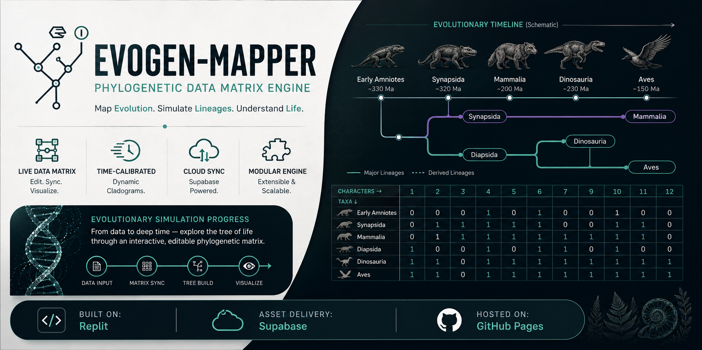

# Evogen-Mapper

  

**Phylogenetic Data Matrix Engine**

An interactive evolutionary biology engine for constructing, editing, and visualizing phylogenetic data matrices, cladograms, and lineage relationships through a modular browser-based interface.

---

## ✨ Features

* **Live Data Matrix:** Create and edit phylogenetic character matrices in real time.
* **Interactive Cladograms:** Generate dynamic evolutionary trees from matrix data.
* **Customizable Nodes:** Add, edit, rename, and reorganize taxa with fully editable phylogenetic nodes.
* **Adjustable Timelines:** Modify evolutionary timelines instantly through the inline database matrix system.
* **Tabbed Workspace:** Manage multiple organisms and evolutionary datasets using a browser-style tab interface.
* **Evolutionary Mapping:** Explore lineage divergence from early amniotes to major vertebrate clades.
* **Developer Tools:** Built-in debugging and live trait manipulation for rapid development and testing.

---

## 📖 User Guide

**Manual:** [`Guide/manual.png`](Guide/manual.png)

---

## 🚀 Platform

* **Frontend:** HTML • CSS • JavaScript
* **Database & Asset Delivery:** Supabase
* **Hosting:** GitHub Pages

---

## 📜 License

GPL-3.0

---

## 👨‍🏫 Author

**Draven Ashcroft**
* M.Sc. Ag. Entomology, ASRB-NET
* DIPS Chain of Institutions