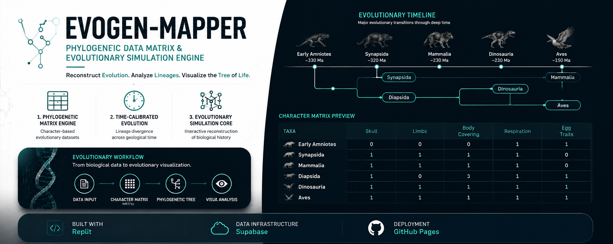

# 🧬 Evogen-Mapper

  
  

  ### *Phylogenetic Data Matrix Engine*

  > An interactive evolutionary biology engine for constructing, editing, and visualizing phylogenetic data matrices, cladograms, and lineage relationships.

  **🧬 Phylogeny · 🌳 Cladistics · 🌀 Evolution**

  ---

  ## ✦ Features

  **📊 Live Data Matrix**  
  Create and edit phylogenetic character matrices in real time.

  **🌳 Interactive Cladograms**  
  Generate dynamic evolutionary trees from matrix data.

  **🧬 Taxa Management**  
  Add, edit, replace, rename, and reorganize taxa.

  **⏳ Evolutionary Timelines**  
  Adjust evolutionary timelines through the matrix interface.

  **📑 Tabbed Workspace**  
  Manage multiple organisms and evolutionary datasets.

  **🛠️ Dev Mode**  
  Access debugging tools and live trait manipulation for development and testing.

  ---

  ## ⚙️ Technology

  **HTML · CSS · JavaScript**

  **Database & Assets:** Supabase  
  **Hosting:** GitHub Pages

  ---

  ## 📜 License

  **GNU General Public License v3.0 (GPL-3.0)**